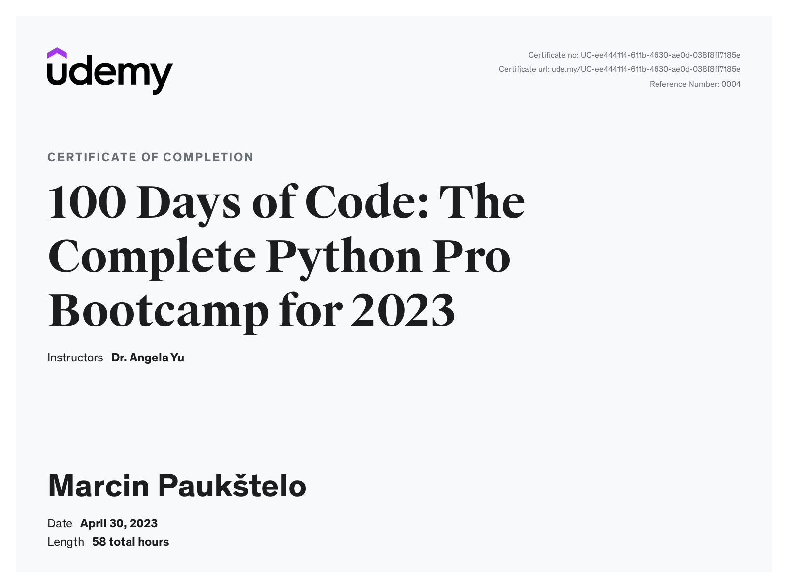
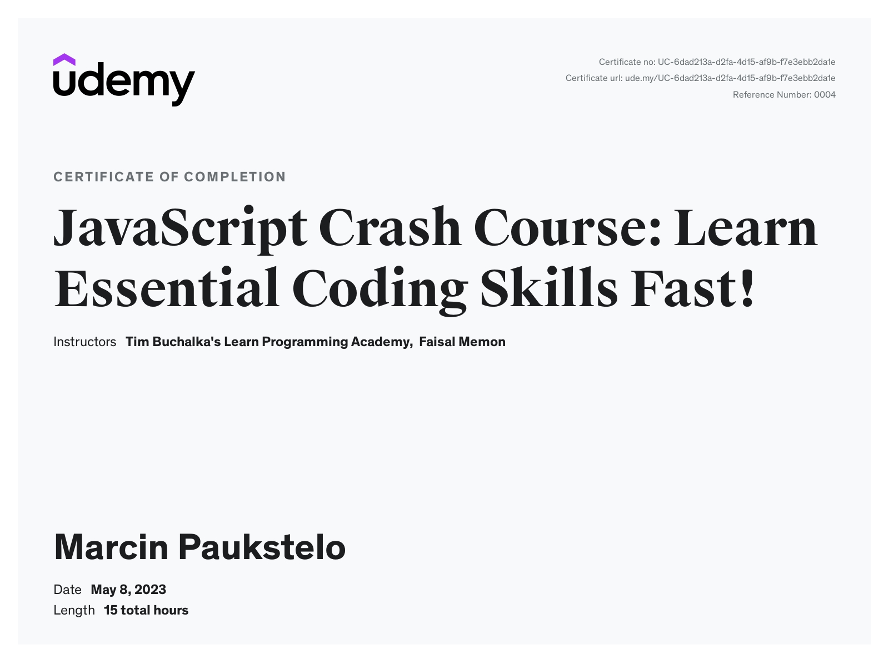

<h1>Hi, I'm Martin!

 
<h2>👨‍💻 Software Development Projects:</h2>

- <b>Python</b>
  - Sponsors data management software for universities (Backebd) [(SponsorBook)](https://github.com/paukstelom/sponsorbook)
  - Sponsors data management software for universities (Frontend) [(SponsorBook)](https://github.com/paukstelom/sponsorbookui)
  
    
 Rest of my learning projects can be found across my repositories, check them out!
 
<h2>📺 Certificates</h2>

- 100 Days of Code: The Complete Python Bootcamp
  
 
  
 
 - JavaScript Crash Course
  

 

<h2> 🤳 Connect with me:</h2>

<a href="https://www.linkedin.com/in/paukstelis/">LinkedIn</a>
